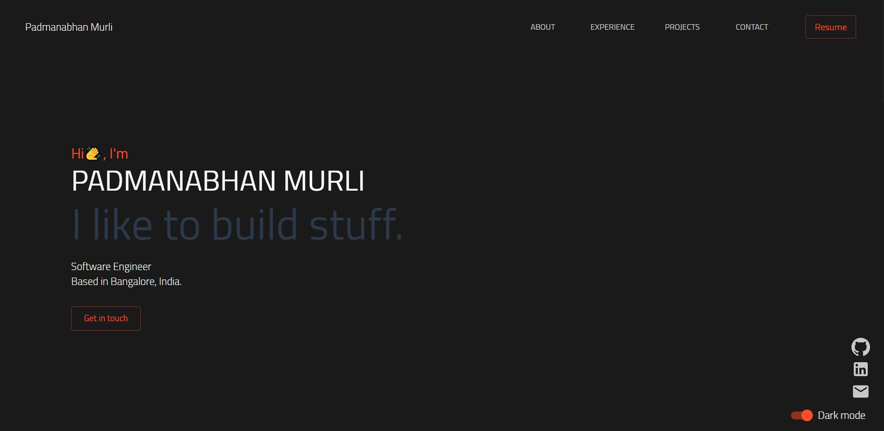

<!-- PROJECT PREVIEW -->
<br />
<p align="center">

  <h1 align="center">Personal Website/Portfolio</h3>

  <p align="center">
    <br />
    <br />
  </p>
</p>


<!-- ABOUT THE PROJECT -->
## About The Project


The website is live at <a href="https://p-murli.github.io/portfolio-app/">https://p-murli.github.io/portfolio-app/</a>

### Forking this project
If someone wants to use this code on his own website, the answer is **YES** BUT please with credits !
I've spent a non-trivial amount of effort building and designing this iteration of my website, and I am proud of it!

### Screenshots

<p align="center">
  <p align="center">Home Section</p>
  
</p>
<br />

### Built With

* [React JS](https://reactjs.org/)
* [Material UI](https://material-ui.com/)
* [Framer Motion](https://www.framer.com/motion/)

<!-- GETTING STARTED -->
## Getting Started

If you want to clone the project and make you personal portfolio

### Installation

1. Clone the repo
   ```sh
   git clone https://github.com/p-murli/portfolio-app.git
   ```
2. Install NPM packages
   ```sh
   npm install
   ```


<!-- LICENSE -->
## License

Distributed under the MIT License. See `LICENSE` for more information.

<!-- Credits -->
## Credits

This website was inspired by the work of Mehdi Ben Hadj Ali. 
Project Link: [https://github.com/Mehdi-BHA/Awesomefolio](https://github.com/Mehdi-BHA/Awesomefolio)
